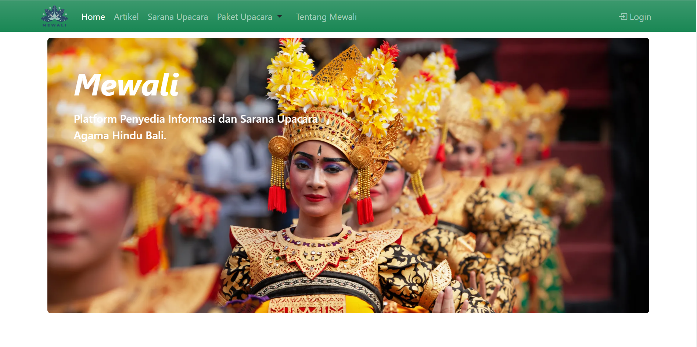
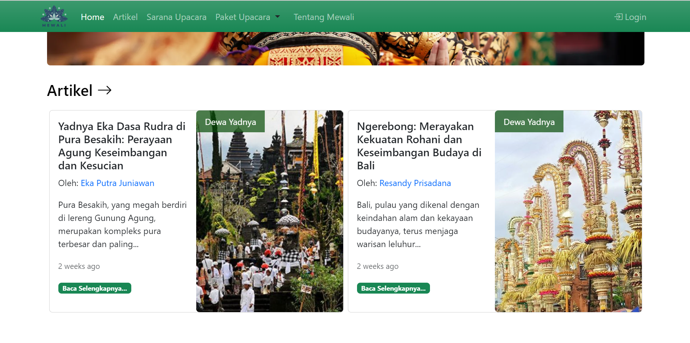
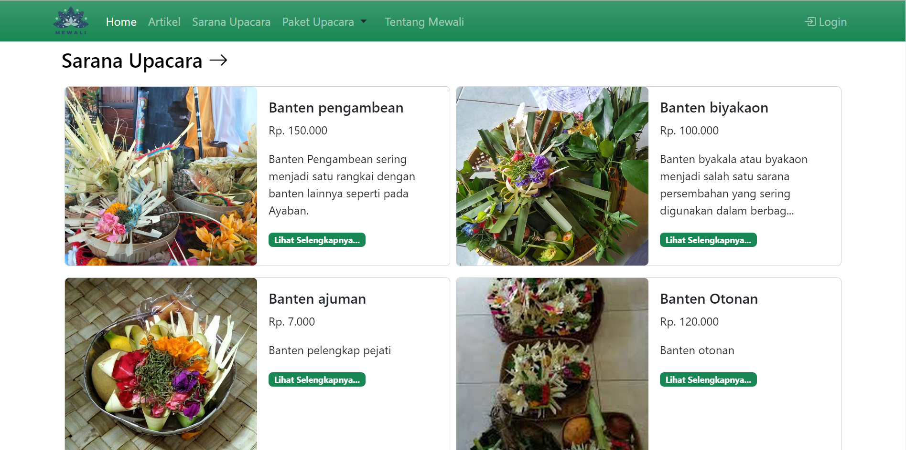
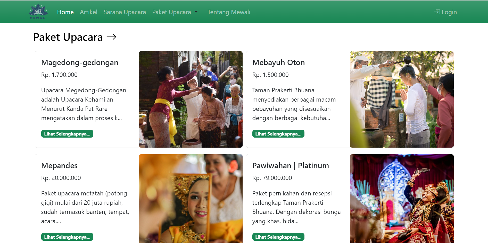
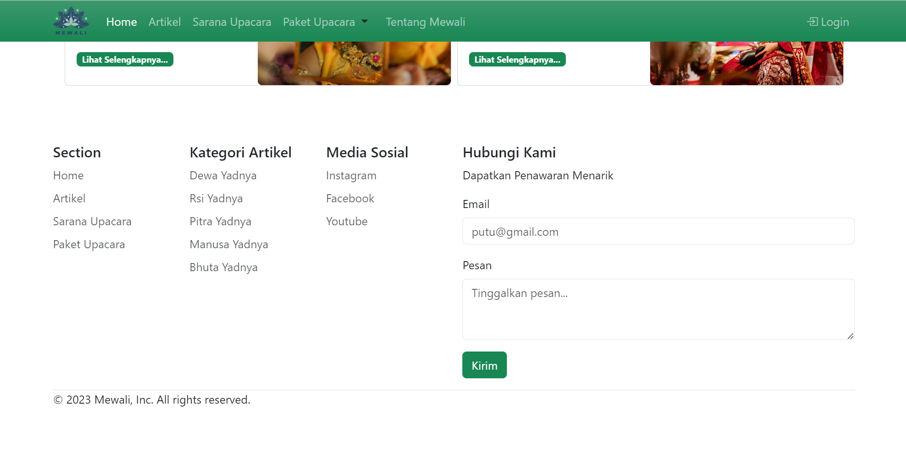
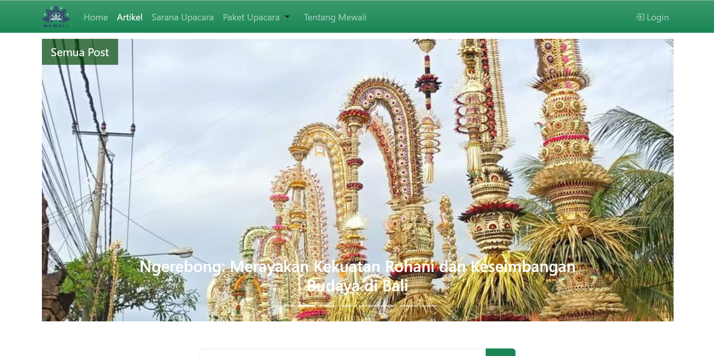
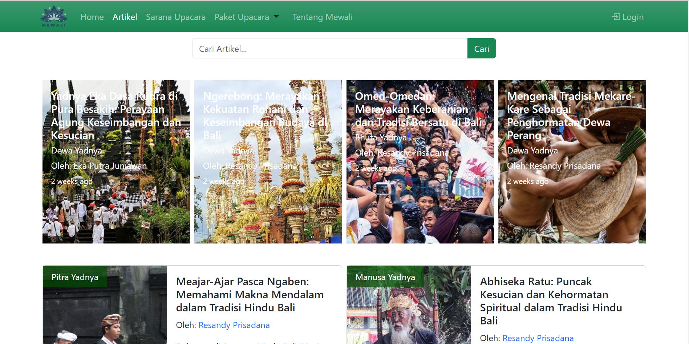
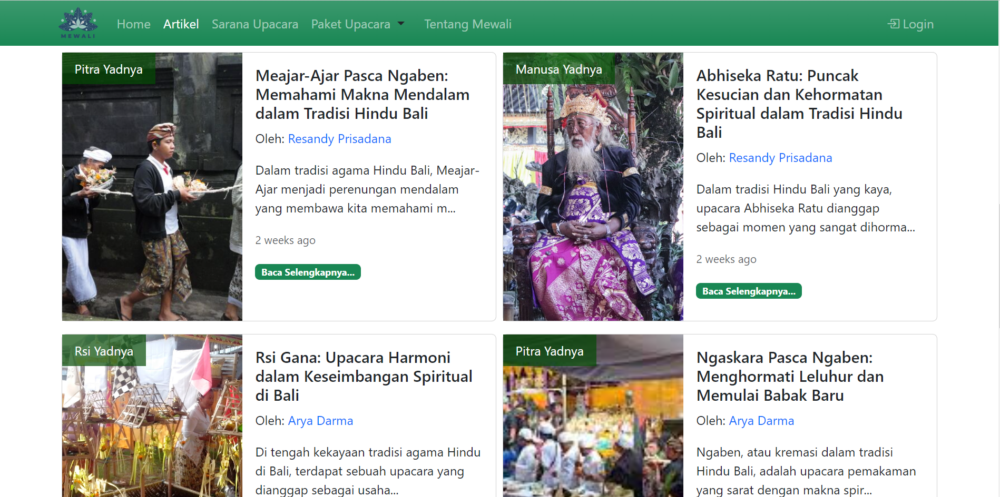

# Mewali | Meyadnya ring Bali

Sebuah platform yang didedikasikan untuk membawa Anda lebih dekat dengan keindahan dan makna di balik upacara agama Hindu. Mewali bukan sekadar situs informasi, tetapi juga merupakan platform dalam memahami, menemukan, dan mengakses sarana upacara serta paket upacara Hindu dengan mudah.

## Halaman Home

Pada tampilan utama pada website Mewali, terdapat halaman utama untuk pengguna yang menampilkan gambaran secara umum pada website Mewali atau dapat dikatakan sebagai tampilan home.

## Halaman Artikel

Pada tampilan daftar artikel pada website Mewali, terdapat daftar artikel tentang upacara agama Hindu di Bali yang berisi judul upacara dan penjelasan tentang upacara tersebut.

