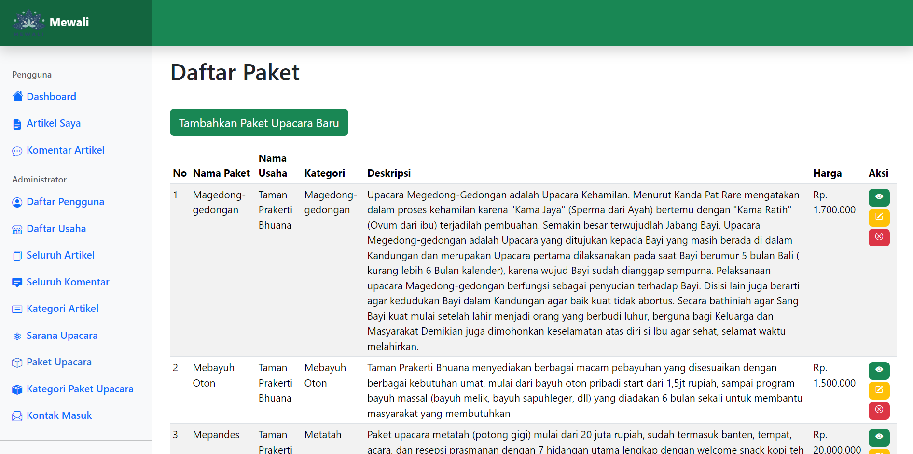

# Mewali | Meyadnya ring Bali

Sebuah platform yang didedikasikan untuk membawa Anda lebih dekat dengan keindahan dan makna di balik upacara agama Hindu. Mewali bukan sekadar situs informasi, tetapi juga merupakan platform dalam memahami, menemukan, dan mengakses sarana upacara serta paket upacara Hindu dengan mudah.

## Halaman Home

Pada tampilan utama pada website Mewali, terdapat halaman utama untuk pengguna yang menampilkan gambaran secara umum pada website Mewali atau dapat dikatakan sebagai tampilan home.

## Halaman Artikel

Pada tampilan daftar artikel pada website Mewali, terdapat daftar artikel tentang upacara agama Hindu di Bali yang berisi judul upacara dan penjelasan tentang upacara tersebut.

## Detail Artikel

Gambar berikut merupakan tampilan User Interface (UI) dari halaman detail artikel yang berisi judul upacara, kategori, pembuat artikel, waktu artikel dibuat, artikel terkait, komentar, button untuk beralih ke artikel yang terbaru dan terlama dan penjelasan tentang upcara tersebut.

## Halaman Sarana Upacara

Pada tampilan daftar penyedia sarana pada website Mewali, terdapat daftar penyedia sarana upacara agama Hindu di Bali yang berisi nama nama dari sarana upacara tersebut.

## Detail Sarana

Gambar berikut merupakan tampilan User Interface (UI) dari modal detail sarana yang berisi nama, gambar, harga, dan penjelasan dari sarana upacara tersebut.

## Halaman Paket Upacara

Pada tampilan daftar penyedia paket upacara pada website Mewali, terdapat daftar penyedia paket upacara agama Hindu di Bali yang berisi nama nama paket dari upacara tersebut.

## Detail Paket

Gambar berikut merupakan tampilan User Interface (UI) dari halaman detail paket upacara yang berisi nama, deskripsi, include, notes, nama toko, kategori jenis paket, dan harga dari upacara tersebut.

## Halaman Tentang Mewali

Pada tampilan tentang mewali pada website Mewali, terdapat penjelasan dan tujuan dari website mewali yang mana tujuannya yaitu untuk menyajikan informasi mendalam mengenai proses upacara agama Hindu, dari upacara kecil hingga upacara besar, sehingga setiap langkahnya dapat dijelaskan dengan jelas dan bermakna.

## Halaman Login dan Register

Pada tampilan log in dan register pada website Mewali, terdapat kolom kolom yang perlu diisi untuk masuk maupun daftar sebagai pengguna baru. Dengan adanya fitur ini akan mempermudah pengguna ketika ingin membuat artikel, sarana upacara maupun paket sarana upacara.

## Dashboard Admin

Pada tampilan dashboard role admin pada website Mewali, terdapat beberapa informasi yang ada pada halaman ini. Informasi tersebut yaitu, pada sidebar terdapat beberapa fitur untuk role admin seperti Dashboard, Artikel Saya, Komentar Artikel, Profile dan Logout.

## Dashboard Super Admin

Pada tampilan dashboard role super admin pada website Mewali, terdapat beberapa informasi yang ada pada halaman ini. Informasi tersebut yaitu, pada sidebar terdapat beberapa fitur untuk role super admin seperti Dashboard, Artikel Saya, Komentar Artikel, Profile dan Logout. Selain itu ada fitur tambahan yang tidak dimiliki oleh role admin dan hanya dimiliki oleh role super admin yaitu, Daftar Pengguna, Daftar Usaha, Seluruh Artikel, Seluruh Komentar, Kategori Artikel, Sarana Upacara, Paket Upacara dan Kategori Paket Upacara.

<small> © Copyright 2023 | All Rights Reserved </small>
